<div align="center">

  

</div>

# My Pocket

<div align="center">

<pre>
███╗   ███╗██╗   ██╗    ██████╗  ██████╗  ██████╗██╗  ██╗███████╗████████╗
████╗ ████║╚██╗ ██╔╝    ██╔══██╗██╔═══██╗██╔════╝██║ ██╔╝██╔════╝╚══██╔══╝
██╔████╔██║ ╚████╔╝     ██████╔╝██║   ██║██║     █████╔╝ █████╗     ██║
██║╚██╔╝██║  ╚██╔╝      ██╔═══╝ ██║   ██║██║     ██╔═██╗ ██╔══╝     ██║
██║ ╚═╝ ██║   ██║       ██║     ╚██████╔╝╚██████╗██║  ██╗███████╗   ██║
╚═╝     ╚═╝   ╚═╝       ╚═╝      ╚═════╝  ╚═════╝╚═╝  ╚═╝╚══════╝   ╚═╝
</pre>

### A glassy personal savings board for flexible monthly or lifetime goals

Black glass UI • Pocket targets • Firebase sync • Smart reminders


<br>


</div>

---

## Download

<div align="center">

<h3>Latest Release</h3>

<a href="https://github.com/TheAmazo/My_Pocket/releases/latest">
  
</a>

<br><br>

<a href="https://github.com/TheAmazo/My_Pocket/releases/download/v4.0.0/MyPocket-v4.0.0-debug.apk">
  
</a>

</div>

### Version 4.0.0 APK

The version 4 GitHub release includes a test-installable APK:

```text
MyPocket-v4.0.0-debug.apk
```

Download it from [My Pocket v4.0.0](https://github.com/TheAmazo/My_Pocket/releases/tag/v4.0.0).

SHA-256:

```text
8709e935a8beb588409504828d155b6311d8dd8055350ad7ce2d513e6e904e1e
```

This APK is debug-signed for version 4 testing. A production APK should be signed with a private release keystore that stays outside Git.

### What Is New In v4.0.0

- Pockets can now have an optional Monthly or Lifetime target amount, or stay flexible with no target.
- Target pockets create and trim open savings cards around the remaining amount while saved history stays safe.
- Cleaned up light and dark glass cards to remove ghost shadows and square artifacts.
- Firestore rules now accept the new target fields and tolerate older board totals during safe owner-only refreshes.
- Open savings cards now get fresh lower-biased random values once per day, while saved and locked history stays unchanged.
- Android system back now follows in-app navigation on supported screens.
- Reminder time now opens a clock picker and requests notification permission when needed.
- A refined iOS-inspired black glass dark theme with white-blend glass cards.
- A unified Savings logo across launcher, onboarding, pocket picker, and README.
- Pocket creation now captures both pocket name and purpose.
- Pocket headers now show the selected pocket name instead of a repeated app title.
- Summary is cleaner with one yearly saved card above monthly history.
- Daily reminders support both hour and minute settings.
- Theme settings now support System, Light, and Dark.
- Google sign-in error 10 now explains the Firebase SHA fingerprint fix clearly.

---

## Why My Pocket?

My Pocket replaces manual savings sheets with a focused Android app. Each pocket can have its own purpose and optional target, every month gets a clean savings board, and the app keeps saved totals, remaining amounts, yearly progress, and reminders in sync without messy marks or wrong calculations.

---

## Preview

### Light Card Mode

<div align="center">

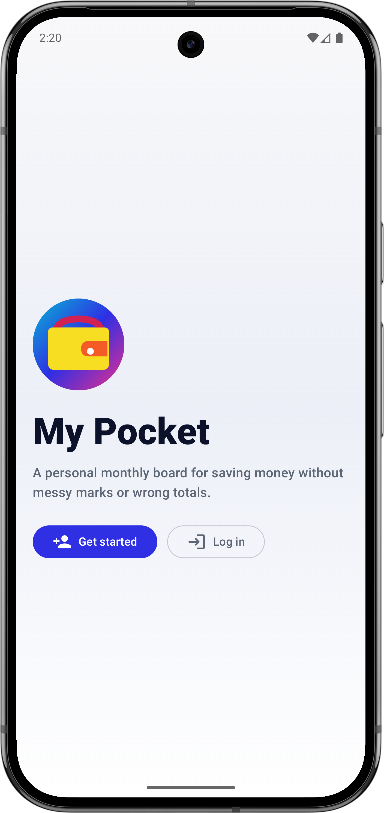
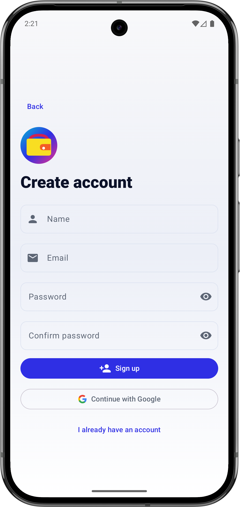
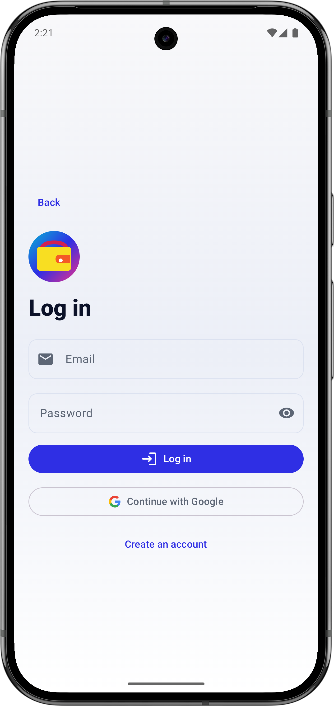
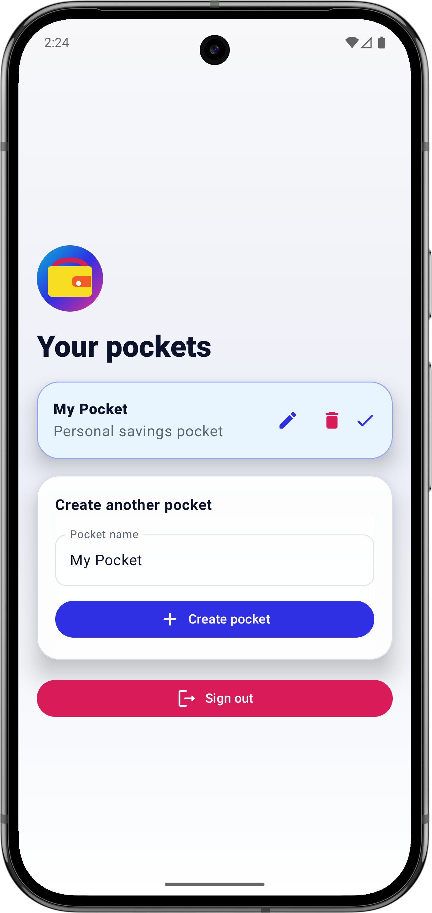

<br><br>

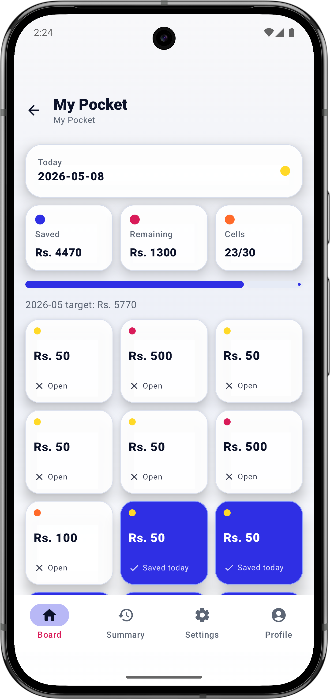
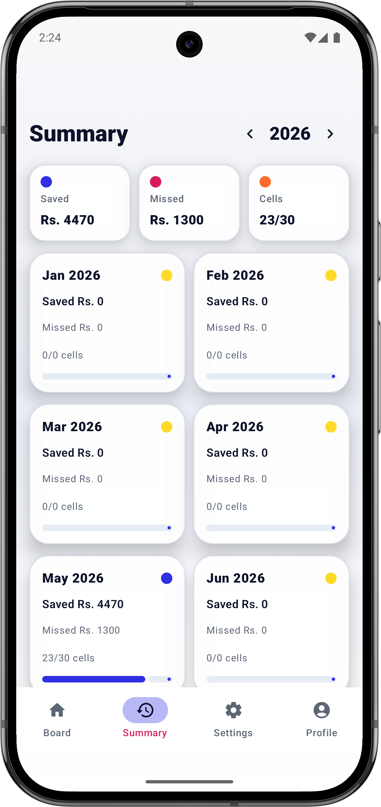
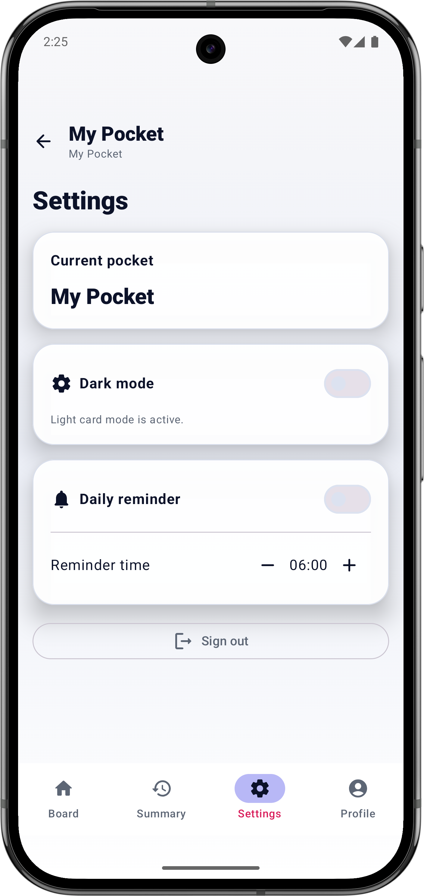
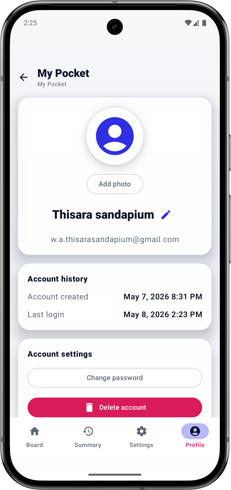

</div>

### iOS-Inspired Black Glass Mode

<div align="center">

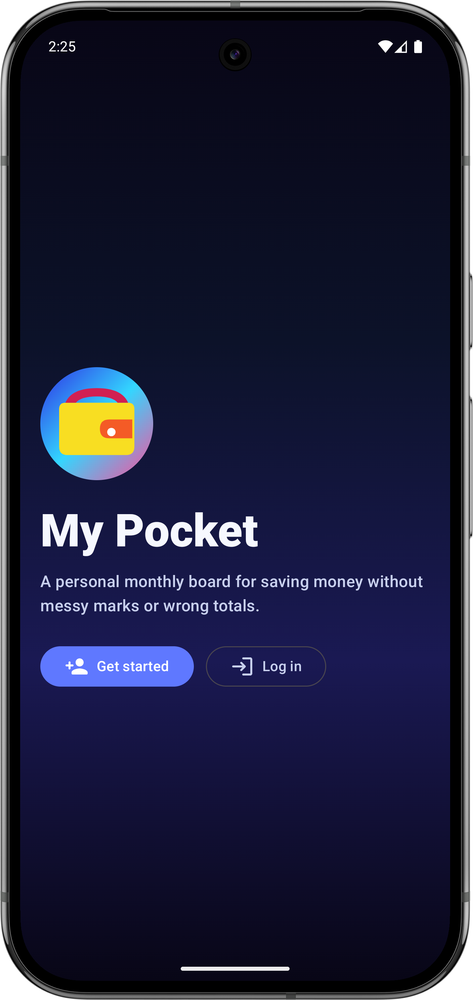
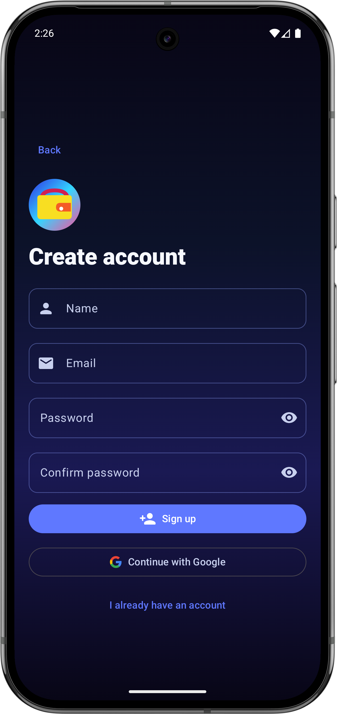
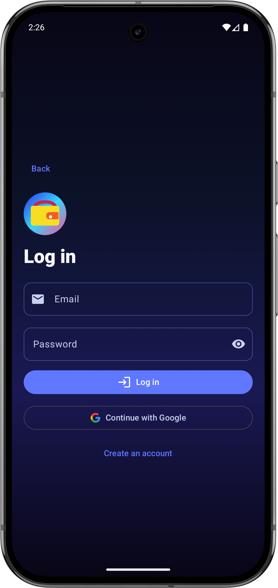

<br><br>

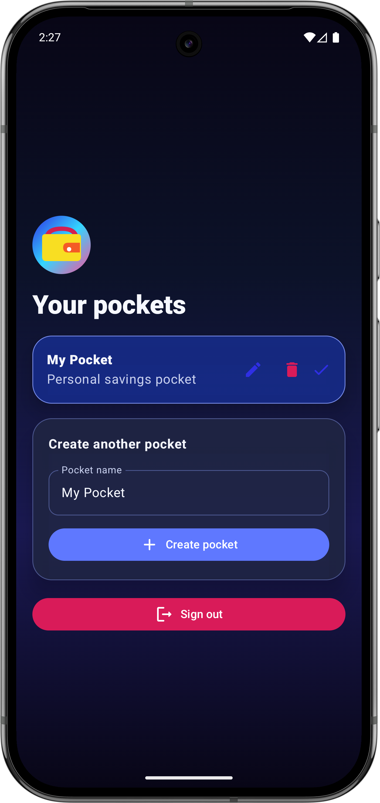
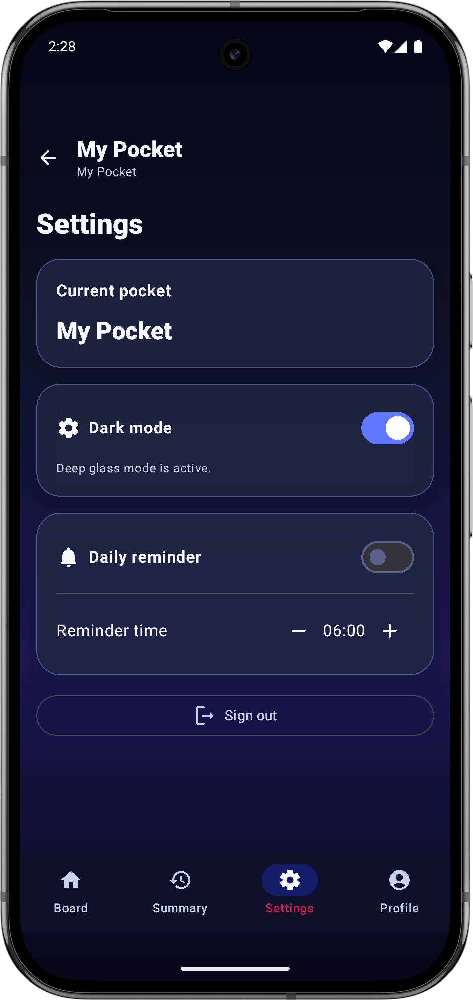
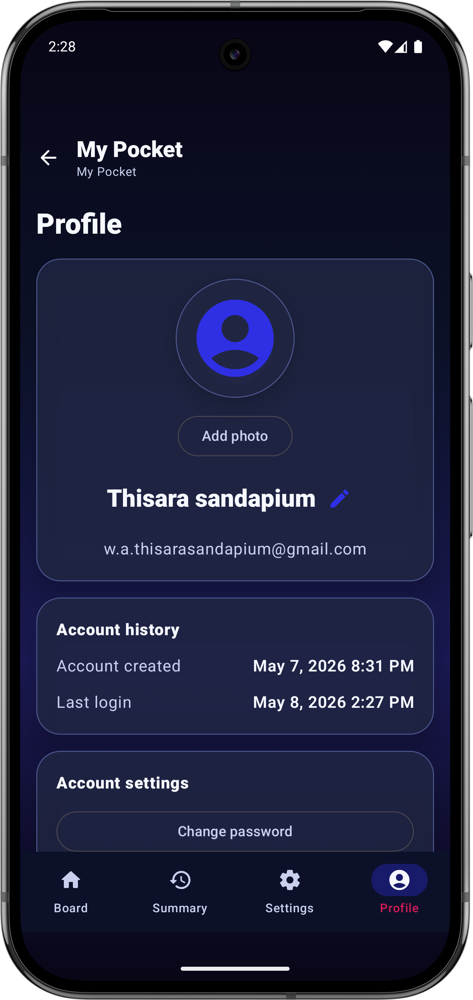

</div>

---

## Highlights

### Version 4 Experience

- Premium light card mode for clean daily use
- iOS-inspired black glass dark mode with cleaner flat cards
- Rounded finance-style cards, buttons, inputs, and board cells
- Theme modes for System, Light, and Dark
- Unified Savings logo across launcher, onboarding, pocket picker, and README
- Password show and hide controls on password fields

### Savings Board

- Flexible monthly boards with open-card values from `20`, `50`, `100`, `500`, and `1000`
- Optional pocket targets generate the number of open cards needed for the remaining amount
- Multiple cells can be saved on the same day
- Open cells stay at the top so saving feels natural
- Saved cells from previous days lock and move below open cells
- If a monthly board is completed early, a new random round is generated
- Monthly target, saved total, remaining total, and progress update automatically

### Pockets

- Create multiple personal pockets with a custom purpose
- Add an optional Monthly or Lifetime target, or leave the target blank
- Edit pocket name, purpose, and target safely
- Delete pockets only after confirmation
- Duplicate pocket names are blocked
- Deleting one pocket does not damage the rest of the account

### Summary

- Yearly overview with 12 month cards
- Single Yearly saved card above monthly summaries
- Saved total, missed amount, completed cells, and progress per month
- Month detail screen shows every day of the month
- Saved rows include amount, saved time, and saved user name

### Profile

- Editable full name
- Email shown as read-only account identity
- Account created date and last login date
- Change password flow for email accounts
- Delete account flow with confirmation
- Free Firebase Spark-plan avatar storage using compressed Firestore `photoData`

### Security And Reliability

- Firebase Auth email verification
- Google sign-in support
- Owner-only Firestore rules
- Firestore validation for users, pockets, months, and cells
- Clear Google status code 10 guidance for missing Firebase SHA fingerprints
- No Firebase Storage required for avatars
- Cleartext HTTP disabled
- Android backup disabled for app data
- Release build uses R8 shrinking and obfuscation
- Local Firebase config and signing files are ignored by Git

---

## Tech Stack

| Layer | Stack |
| --- | --- |
| Language | Kotlin |
| UI | Jetpack Compose + Material 3 |
| Architecture | ViewModel + StateFlow + repository layer |
| Authentication | Firebase Auth |
| Database | Cloud Firestore |
| Local Settings | Android DataStore |
| Reminders | AlarmManager + Notifications |
| Build | Gradle Kotlin DSL |
| Tests | JUnit |

---

## Project Structure

```text
My_Pocket/
├── app/
│   ├── src/main/java/com/thisara/mypocket/
│   │   ├── data/
│   │   ├── reminders/
│   │   ├── ui/
│   │   ├── MainActivity.kt
│   │   └── MyPocketApplication.kt
│   ├── src/main/res/
│   └── google-services.json        # local only, ignored by Git
├── assets/
│   └── my-pocket-icon.png
├── docs/
│   └── FIREBASE_SETUP.md
├── Screenshots/
│   ├── dark/
│   └── light/
├── firestore.rules
├── firebase.json
├── gradle/
├── build.gradle.kts
└── settings.gradle.kts
```

---

## Run Locally

### Requirements

- Android Studio Ladybug or newer
- JDK 17
- Android SDK 36
- Firebase project `my-pocket-a381c`
- Local `app/google-services.json`

### Android Studio

Open the full project folder:

```text
/Users/thisara/Desktop/My_Pocket
```

Then:

1. Wait for Gradle Sync.
2. Select the `app` run configuration.
3. Select an emulator or Android phone.
4. Press Run.

Do not open only the `app` folder. Android Studio needs the root Gradle files.

### Terminal Checks

```bash
./gradlew test assembleDebug
./gradlew lintDebug
./gradlew assembleRelease
```

---

## Firebase Setup

Firebase project:

```text
my-pocket-a381c
```

Android package:

```text
com.thisara.mypocket
```

Required products:

- Authentication
- Cloud Firestore

Not required:

- Firebase Storage
- Cloud Functions
- Paid Firebase plan

Full setup guide: [docs/FIREBASE_SETUP.md](docs/FIREBASE_SETUP.md)

---

## Firestore Shape

```text
users/{uid}
pockets/{pocketId}
pockets/{pocketId}/months/{monthKey}
pockets/{pocketId}/months/{monthKey}/cells/{cellId}
```

Pocket documents include the owner, display name, and purpose:

```text
pockets/{pocketId}.name
pockets/{pocketId}.purpose
pockets/{pocketId}.createdBy
```

Profile avatars are stored as small compressed Base64 data strings:

```text
users/{uid}.photoData
```

This keeps the app compatible with Firebase Spark plan.

---

## Version 3 Checklist

- Email/password signup and verification
- Google sign-in
- Create, edit, delete, and switch pockets
- Duplicate pocket-name blocking
- Monthly savings board
- Multiple saves per day
- Locked previous-day cells
- Yearly and monthly summary
- Profile edit, avatar, password, and account delete tools
- Daily reminders with hour and minute settings
- Responsive UI for phones, tablets, portrait, and landscape
- Firestore rules validated with the local emulator

---

## Git Notes

GitHub Desktop should show source changes without IDE/build noise. These files stay local:

- `.idea/`
- `.gradle/`
- `.kotlin/`
- `local.properties`
- `app/build/`
- `app/google-services.json`
- signing keys
- Firebase debug logs

---

## License

Private learning project.
